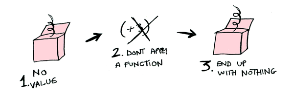

# Funktory, funktory aplikatywne i monady w obrazkach

Autor: Aditya Bhargava<br>
Oryginalny post: [Functors, Applicatives, And Monads In Pictures](http://adit.io/posts/2013-04-17-functors,_applicatives,_and_monads_in_pictures.html)

Mamy prostą wartość (ang. value):


I wiemy, jak zastosować do tej wartości funkcję:


Dość proste. Powiedzmy więc, że wartość może być umieszczona w kontekście. Za kontekst przyjmijmy pudełko, do którego została zapakowana:


Teraz wywołując funkcję otrzymamy różne wyniki **w zależności od kontekstu**. To na tej idei oparte są funktory (ang. functor, w Haskellu `Functor`), funktory aplikatywne (ang. applicative functor, `Applicative`), monady (ang. monad, `Monad`) itp. Typ danych `Maybe` (pol. [być] może) definiuje dwa powiązane konteksty:


Za chwilę zorientujemy się jak różny jest wynik wywołania w zależności od tego, czy argumentem jest `Just a` czy `Nothing`. Jednak najpierw wspomnijmy o funktorach.

## `Functor`y

Gdy wartość jest zapakowana w kontekst, nie można na niej wykonać normalnej funkcji:


W takim przypadku przydaje się `fmap`, bo jest na bieżąco z kontekstami. `fmap` wie, jak wywoływać funkcje na argumentach opaktowanych w kontekst. Dla przykładu żałóżmy, że chcemy wywołać `(+3)` na `Just 2`. Korzystając z `fmap`:
```haskell
> fmap (+3) (Just 2)
Just 5
```


**Bum!** `fmap` pokazał nam jak to się robi! Ale skąd wie, jak wywołać funkcję?

## Czym naprawdę jest `Functor`?

`Functor` jest [typeklasą](http://learnyouahaskell.com/types-and-typeclasses#typeclasses-101). Oto jego definicja:


1. Aby uczynić z typu danych f funktor,
2. ten typ musi zdefiniować sposób, w który `fmap` będzie na nim operował.

`Functor`em jest każdy typ danych, który definiuje, w jaki sposób operuje na nim `fmap`. Oto jak działa `fmap`:


1. Bierze funkcję (jak `(+3)`)
2. i funktor (jak `Just 2`),
3. i zwraca nowy funktor (jak `Just 5`).

Możemy więc zrobić tak:

```haskell
> fmap (+3) (Just 2)
Just 5
```

I `fmap` magicznie wykonuje funkcję, bo `Maybe` jest `Functor`em. Specyfikuje, w jaki sposób `fmap` stostuje funkcję wobec `Just`–ów i `Nothing`–ów:

```haskell
instance Functor Maybe where
    fmap func (Just val) = Just (func val)
    fmap func Nothing = Nothing
```

Oto co dzieje się za kulisami, gdy piszemy `fmap (+3) (Just 2)`:


1. Rozpakuj wartość z kontekstu.
2. Wykonaj funkcję.
3. Ponownie zapakuj wartość do kontekstu.

A co, gdybyśmy kazali `fmap`owi zastosować `(+3)` na `Nothing`?



1. Brak wartości.
2. Nie wywołuj funkcji.
3. Pozostajemy z niczym.

```Haskellu
> fmap (+3) Nothing
Nothing
```


>Nic (nie) wchodzi, nic (nie) wychodzi
>
>Tego nie ogarniesz!

Jak Morfeusz w Matrixie, `fmap` po prostu wie, co trzeba robić. Zaczynasz z `Nothing` i kończysz z `Nothing`! Staje się jasne, dlaczego powstał typ `Maybe`. Dla przykładu, w języku bez `Maybe` można by pracować z rekordem bazy danych w poniższy sposób:

```ruby
post = Post.find_by_id(1)
if post
  return post.title
else
  return nil
end
```

Jednak w Haskellu można tak:

```haskell
fmap (getPostTitle) (findPost 1)
```

Jeśli `findPost` znajdzie posta, dostaniemy jego tytuł z `getPostTitle`. Natomiast jeśli zwróci `Nothing`, dostaniemy `Nothing`! Nieźle, co? `<$>` jest infiksową wersją `fmap`, więc częściej możesz spotkać taką konstrukcję:

```haskell
getPostTitle <$> (findPost 1)
```

Weźmy inny przykład. Co stanie się, gdy wywołamy funkcję na liście?


1. Lista wartości.
2. Wywołaj funkcję dla każdej z wartości.
3. Nowa lista wartości.

Listy też są funktorami. Oto definicja:

```haskell
instance Functor [] where
    fmap = map
```

No, to jeszcze ostatni przykład. Co stanie się, gdy do funkcji przekażemy inną funkcję?

```haskell
fmap (+3) (+1)
```

Tu funkcja:


A tu funkcja wywołana z funkcją jako argumentem:


Wynikiem jest po prostu inna funkcja!

```haskell
> import Control.Applicative
> let foo = fmap (+3) (+2)
> foo 10
15
```

A więc funkcje też są `Functor`ami!

```haskell
instance Functor ((->) r) where
    fmap f g = f . g
```

Używając `fmap` na funkcji, tak naprawdę po prostu komponujesz funkcje!

(c.d.n.)