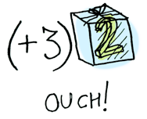

# Funktory, funktory aplikatywne i monady w obrazkach

Autor: Aditya Bhargava<br>
Oryginalny post: [Functors, Applicatives, And Monads In Pictures](http://adit.io/posts/2013-04-17-functors,_applicatives,_and_monads_in_pictures.html)

Mamy prostą wartość (ang. value):


I wiemy, jak zastosować do tej wartości funkcję:


Dość proste. Powiedzmy więc, że wartość może być umieszczona w kontekście. Za kontekst przyjmijmy pudełko, do którego została zapakowana:


Teraz wywołując funkcję otrzymamy różne wyniki **w zależności od kontekstu**. To na tej idei oparte są funktory (ang. functor, w Haskellu `Functor`), funktory aplikatywne (ang. applicative functor, `Applicative`), monady (ang. monad, `Monad`) itp. Typ danych `Maybe` (pol. [być] może) definiuje dwa powiązane konteksty:


Za chwilę zorientujemy się jak różny jest wynik wywołania w zależności od tego, czy argumentem jest `Just a` czy `Nothing`. Jednak najpierw wspomnijmy o funktorach.

## Funktory

Gdy wartość jest zapakowana w kontekst, nie można na niej wykonać normalnej funkcji:



W takim przypadku przydaje się `fmap`, bo jest na bieżąco z kontekstami. `fmap` wie, jak wywoływać funkcje na argumentach opakowanych w kontekst. Dla przykładu żałóżmy, że chcemy wywołać `(+3)` na `Just 2`. Korzystając z `fmap`:
```haskell
> fmap (+3) (Just 2)
Just 5
```


**Bum!** `fmap` pokazał nam jak to się robi! Ale skąd wie, jak wywołać funkcję?

## Czym naprawdę jest `Functor`?

`Functor` jest [typeklasą](http://learnyouahaskell.com/types-and-typeclasses#typeclasses-101). Oto jego definicja:


1. Aby uczynić z typu danych f funktor,
2. ten typ musi zdefiniować sposób, w który `fmap` będzie na nim operował.

`Functor`em jest każdy typ danych, który definiuje, w jaki sposób operuje na nim `fmap`. Oto jak działa `fmap`:


1. Bierze funkcję (jak `(+3)`)
2. i funktor (jak `Just 2`),
3. i zwraca nowy funktor (jak `Just 5`).

Możemy więc zrobić tak:

```haskell
> fmap (+3) (Just 2)
Just 5
```

I `fmap` magicznie wykonuje funkcję, bo `Maybe` jest `Functor`em. Specyfikuje, w jaki sposób `fmap` stostuje funkcję wobec `Just`–ów i `Nothing`–ów:

```haskell
instance Functor Maybe where
    fmap func (Just val) = Just (func val)
    fmap func Nothing = Nothing
```

Oto co dzieje się za kulisami, gdy piszemy `fmap (+3) (Just 2)`:


1. Rozpakuj wartość z kontekstu.
2. Wykonaj funkcję.
3. Ponownie zapakuj wartość do kontekstu.

A co, gdybyśmy kazali `fmap`owi zastosować `(+3)` na `Nothing`?


1. Brak wartości.
2. Nie wywołuj funkcji.
3. Pozostajemy z niczym.

```Haskellu
> fmap (+3) Nothing
Nothing
```


>Nic (nie) wchodzi, nic (nie) wychodzi
>
>Tego nie ogarniesz!

Jak Morfeusz w Matrixie, `fmap` po prostu wie, co trzeba robić. Zaczynasz z `Nothing` i kończysz z `Nothing`! Staje się jasne, dlaczego powstał typ `Maybe`. Dla przykładu, w języku bez `Maybe` można by pracować z rekordem bazy danych w poniższy sposób:

```ruby
post = Post.find_by_id(1)
if post
  return post.title
else
  return nil
end
```

Jednak w Haskellu można tak:

```haskell
fmap (getPostTitle) (findPost 1)
```

Jeśli `findPost` znajdzie posta, dostaniemy jego tytuł z `getPostTitle`. Natomiast jeśli zwróci `Nothing`, dostaniemy `Nothing`! Nieźle, co? `<$>` jest infiksową wersją `fmap`, więc częściej możesz spotkać taką konstrukcję:

```haskell
getPostTitle <$> (findPost 1)
```

Weźmy inny przykład. Co stanie się, gdy wywołamy funkcję na liście?


1. Lista wartości.
2. Wywołaj funkcję dla każdej z wartości.
3. Nowa lista wartości.

Listy też są funktorami. Oto definicja:

```haskell
instance Functor [] where
    fmap = map
```

No, to jeszcze ostatni przykład. Co stanie się, gdy do funkcji przekażemy inną funkcję?

```haskell
fmap (+3) (+1)
```

Tu funkcja:


1. Bierze wartość.
2. Zwraca wartość.

A tu funkcja wywołana z funkcją jako argumentem:


Wynikiem jest po prostu inna funkcja!

```haskell
> import Control.Applicative
> let foo = fmap (+3) (+2)
> foo 10
15
```

A więc funkcje też są `Functor`ami!

```haskell
instance Functor ((->) r) where
    fmap f g = f . g
```

Używając `fmap` na funkcji, tak naprawdę po prostu komponujesz funkcje!

## Funktory aplikatywne

Funktory aplikatywne (`Applicative`) wchodzą na nieco wyższy poziom. Podobnie jak ze zwyczajnymi funktorami (`Functor`), nasze wartości są opakowane w kontekst:


Jednak także nasze funkcje także są opakowane w kontekst!


Tak, niech to zapadnie w pamięć. Funktory aplikatywne się nie patyczkują. `Control.Applicative` definiuje `<*>`, który wie, jak zastosować opakowaną w kontekst funkcję do zapakowanej wartości:


1. Funckja opakowana w kontekst.
2. Wartość w kontekście.
3. Odpakuj obie i zastosuj funkcję do wartości.
4. Nowa wartość w kontekście.

To jest:

```haskell
Just (+3) <*> Just 2 == Just 5
```

Użycie `<*>` może doprowadzić do interesujących sytuacji, np.:

```haskell
> [(*2), (+3)] <*> [1, 2, 3]
[2, 4, 6, 4, 5, 6]
```


A teraz coś, czego nie można zrobić zwykłym funktorem, ale można funktorem aplikatywnym. Jak wykonać funkcję dwóch zmiennych na dwóch zapakowanych wartościach?

```haskell
> (+) <$> (Just 5)
Just (+5)
> Just (+5) <$> (Just 4)
ERROR ??? CO TO W OGÓLE MA ZNACZYĆ CZEMU FUNKCJA JEST ZAPAKOWANA W JUST
```

Funktor aplikatywny:

```haskell
> (+) <$> (Just 5)
Just (+5)
> Just (+5) <*> (Just 3)
Just 8
```

`Applicative` odsuwa `Functor` na bok. "Duzi chłopcy mogą używać funkcji z dowolną liczbą argumentów" – mówi. "Uzbrojony w `<$>` i `<*>` mogę wziąć dowolną funkcję oczekującą dowolną liczbę nieopakowanych wartości. Przekazuję jej wszystkie wartości zapakowane i otrzymuję zapakowany wynik! AHAHAHAHAH!"

```haskell
> (*) <$> Just 5 <*> Just 3
Just 15
```

Jest też funkcja nazwana `liftA2`, która robi dokładnie to samo:

```haskell
> liftA2 (*) (Just 5) (Just 3)
Just 15
```

## Monady

Jak nauczyć się o monadach:
1. Zrób doktorat z informatyki.
2. Wyrzuć go do śmieci, bo nie będzie potrzebny w tej sekcji!

Monady dodają coś jeszcze.

Funktory wykonują funkcję na opakowanej wartości:


Funktory aplikatywne wykonują opakowaną funkcję na opakowanej wartości:


Monady wykonują funkcję, **która zwraca opakowaną wartość** na opakowanej wartości. Monady mają w tym celu funkcję `>>=` (czyt. "bind").

Zobaczmy przykład. Znane nam `Maybe` jest monadą:


Przyjmijmy, że `half` jest funkcją działającą tylko na liczbach parzystych:

```haskell
half x = if even x
           then Just (x `div` 2)
           else Nothing
```


1. Bierze wartość.
2. Zwraca zapakowaną wartość.

Co gdybyśmy podali jej zapakowaną wartość?


Musimy użyć `>>=`, żeby wepchnąć naszą zapakowaną wartość do tej funkcji. Oto zdjęcie `>>=`:


A oto jak działa:

```haskell
> Just 3 >>= half
Nothing
> Just 4 >>= half
Just 2
> Nothing >>= half
Nothing
```

Co dzieje się w środku? `Monad` (monada) jest kolejną typeklasą. Oto część jej definicji:

```haskell
class Monad m where
    (>>=) :: m a -> (a -> m b) -> m b
```

Gdzie `>>=` to:


1. `>>=` bierze monadę (jak `Just 3`)
2. i funkcję, która zwraca monadę (jak `half`)
3. i zwraca monadę.

Więc `Maybe` jest monadą:

```haskell
instance Monad Maybe where
    Nothing >>= func = Nothing
    Just val >>= func  = func val
```

A tutaj w akcji z `Just 3`!


1. `>>=` (czyt. "bind") odpakowuje wartość,
2. podaje odpakowaną wartość do funkcji,
3. wychodzi zapakowana wartość.

A gdy przkażesz na wejściu `Nothing`, jest jeszcze prościej:


1. Nic (nie) wchodzi,
2. nic nie jest robione,
3. nic (nie) wychodzi.

Wywołania można też połączyć w łańcuch:

```haskell
> Just 20 >>= half >>= half >>= half
Nothing
```


Nieźle! Już wiemy, że `Maybe` jest `Functor`em, `Applicative`m i `Monad`ą. Teraz przejdźmy do innego przykładu: monady `IO`:


Skupimy się na trzech funkcjach. `getLine` nie bierze żadnych argumentów i pobiera wejście od użytkownika:


```haskell
getLine :: IO String
```

`readFile` bierze ciąg znaków (nazwę pliku) i zwraca zawartość pliku:


```haskell
readFile :: FilePath -> IO String
```

`putStrLn` bierze ciąg znaków i wypisuje go:


```haskell
putStrLn :: String -> IO ()
```

Wszystkie te trzy funkcje biorą zwyczajną wartość (bądź żadną) i zwracają opakowaną wartość. Możemy wywołać je wszystkie w łańcuchu korzystając z `>>=`!


```haskell
getLine >>= readFile >>= putStrLn
```

1. Pobierz wejście od użytkownika.
2. Użyj go do otwarcia pliku.
3. Wypisz zawartość pliku.

O, tak! Pierwszy rząd na występach monad!

Haskell dostarcza także cukier składniowy do operacji na monadach, zwany *`do` notation*, notacją `do`:

```haskell
foo = do
    filename <- getLine
    contents <- readFile filename
    putStrLn contents
```

## Podsumowanie

1. Funktor jest typem danych implementującym typeklasę `Functor`.
2. Funktor aplikatywny jest typem danych implementującym typeklasę `Applicative`.
3. Monada jest typem danych implementującym typeklasę `Monad`.
4. `Maybe` implementuje wszystkie te trzy, jest więc funktorem, funktorem aplikatywnym i monadą.

Jakie są między nimi różnice?


* **Funktory**: wykonujesz funkcję na opakowanej wartości używając `fmap` bądź `<$>`.
* **Funktory aplikatywne**: wykonujesz opakowaną funkcję na opakowanej wartości używając `<*>` bądź `liftA`.
* **Monady**: wykonujesz funkcję zwracającą opakowaną wartość na opakowanej wartości używając `>>=` bądź `liftM`.

Więc, drogi kumplu (myślę, że na tym etapie jesteśmy już kumplami), myślę, że zgodzimy się oboje, że monady są łatwe i że są DOBRYM POMYSŁEM™. Skoro już napociłeś się czytając ten przewodnik, czemu by nie pójść na całość? Przejrzyj [rozdział o monadach](http://learnyouahaskell.com/a-fistful-of-monads) w Learn You A Haskell (ang). Jest wiele rzeczy, które pominąłem, bo Miran świetnie wgłębia się w ten temat.

---
Od tłumacza: a jeśli masz jeszcze chwilkę, może zainteresują Cię [moje projekty](https://hckr.pl/). ☺